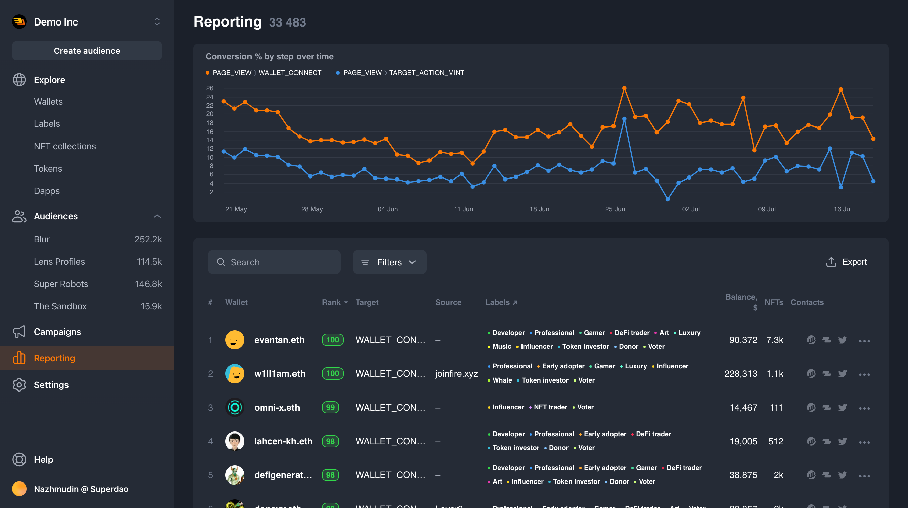

## Web3 app analytics tracker by Superdao

Application that provides our simplified and fast API for collecting analytics data. Build over https://www.npmjs.com/package/analytics

Sample UI build with tracker data of visits and target actions:


This repository has two parts:

1. Frontend (@sd/tracker) - client code that connects to the frontend and runs in the client's browser, is responsible for the initial collection of data and sending it to the backend API.
2. Backend is a NestJS server application that provides the frontend with the `/collect` endpoint for initial saving data to the message queue (in our case it is Kafka).

Here is instruction how to connect builded tracker to yours site: https://superdao.notion.site/Superdao-Tracker-setup-guide-50694a2ec687415abd28b65bb44cf337. `TRACKER_ID` just UUIDv4 for separate clients/projects.

## Sample tracker data

After successfully processing the event, you will be able to see similar messages in the Kafka queue:

```
{
   "user_wallet_address":"0xfd0D87F892ADf8662D7b7223009220B801851B69",
   "tracker_id":"63584b6b-ed36-465b-ad0f-0ab3235d6bff",
   "type":"WALLET_CONNECT",
   "id":"3ce6d21b-0df0-4d7b-bcd5-1603dcb5fe0b",
   "session_id":"3479fd50-25d4-4302-8285-7cdf5567b709",
   "timestamp":1678968187367,
   "anonymous_id":"5641939c-4d4f-454a-a3f8-4cc85f97b112",
   "user_locale":"en-GB",
   "user_timezone":"Asia/Makassar",
   "user_agent":"Mozilla/5.0 (Macintosh; Intel Mac OS X 10_15_7) AppleWebKit/537.36 (KHTML, like Gecko) Chrome/111.0.0.0 Safari/537.36",
   "page_referrer":"",
   "page_url":"http://localhost:3003/",
   "page_path":"/",
   "user_ip":"10.0.5.37"
}
```

## First actions

- Install project dependencies - `pnpm install`
- Completethe configuration file - `apps/backend/.env.development`
- Bring up Kafka queue - `docker-compose up -d`
- Run the server in development mode - `pnpm dev`
- Build production tracker snippet code - `pnpm --filter=@sd/tracker build`, will emit to `apps/frontend/browser`

## Environment variables

Loading different `.env` files depending on `NODE_ENV` variable. Admissible values: `development`, `test`, `production`, `staging`.

### Priority:

1. `.env.development.local` (ignored by git)
2. `.env.development`

## [Swagger UI](https://swagger.io/tools/swagger-ui)

1. Run app in development mode - `pnpm dev`
2. Open [http://localhost:8000/api/](http://localhost:8080/api) to view API docs in the browser

## Update Packages

Via [npm-check-updates](https://www.npmjs.com/package/npm-check-updates)

```sh
npx npm-check-updates --deep --upgrade
```

## Contributors

We are publishing this repository with no commit history, so here is a list of developers, testers and DevOps who contributed

Akim Mamedov
Aleksandr Antsiferov
Aleksandr Khaustov
Anton Iutin
Anton Movshin
Maksim Gubyshev
Vladimir Vlasiuk
